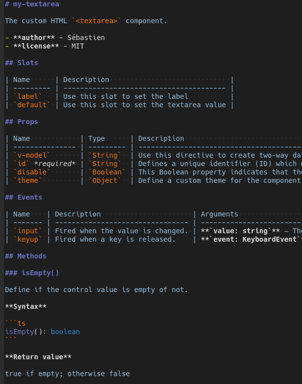

# Vuedoc Markdown Documentation Generator

Generate a Markdown Documentation for a Vue file

[](https://www.npmjs.com/package/@vuedoc/md) [](https://gitlab.com/vuedoc/md/pipelines) [](https://gitlab.com/vuedoc/md/-/jobs)

## Table of Contents

- [Install](#install)
- [Features](#features)
- [Usage](#usage)
- [Command line options](#command-line-options)
- [Programmatic Usage](#programmatic-usage)
- [Documentation Syntax](#documentation-syntax)
- [Visibility Keywords](#visibility-keywords)
- [Specific Keywords for Props](#specific-keywords-for-props)
- [Examples](#examples)
- [Related projects](#related-projects)
- [Contribute](#contribute)
- [Versioning](#versioning)
- [License](#license)

## Install

```sh
# using in your project
npm install --save @vuedoc/parser @vuedoc/md

# using in command line
npm install --global @vuedoc/parser @vuedoc/md
```

## Features

- Generate documentation for component props
- Generate documentation for component data
- Generate documentation for computed properties with their dependencies
- Generate documentation for component events
- Generate documentation for component slots
- Generate documentation for component methods
- Support of JSDoc

## Usage

First use comments to document your component (see [test/fixtures/checkbox.vue](https://gitlab.com/vuedoc/md/blob/master/test/fixtures/checkbox.vue) for a complete example):

```html
<template>
  <div>
    <label :for="id">
      <!-- Use this slot to set the label -->
      <slot name="label"></slot>
    </label>
    <textarea :id="id" v-on:keyup="keyup" v-on:input="input">
      <!-- Use this slot to set the default value -->
      <slot></slot>
    </textarea>
  </div>
</template>

<script>
  /**
   * The custom HTML `<textarea>` component.
   * 
   * @author Sébastien
   * @license MIT
   */
  export default {
    name: 'my-textarea',
    model: {
      prop: 'value',
      event: 'input'
    },
    props: {
      /**
       * Use this directive to create two-way data bindings with the component.
       * It automatically picks the correct way to update the element based on the input type.
       */
      value: { type: String },
      /**
       * Defines a unique identifier (ID) which must be unique in the whole document.
       */
      id: { type: String, required: true },
      /**
       * This Boolean property indicates that the user cannot interact with the control.
       */
      disable: { type: Boolean, default: false },
      /**
       * Define a custom theme for the component.
       * @default new DefaultTextareaTheme()
       * @type TextareaTheme
       */
      theme: {
        type: Object,
        default: () => new DefaultTextareaTheme()
      }
    },
    methods: {
      /**
       * Define if the control value is empty of not.
       * @return {boolean} true if empty; otherwise false
       */
      isEmpty() {
        return !this.value || this.value.length === 0
      },
      /**
       * This will be ignored on rendering
       * @private
       */
      input(e) {
        this.value = e.target.value

        /**
         * Fired when the value is changed.
         * @param {string} value - The updated value
         */
        this.$emit('input', this.value)
      },
      /**
       * This will be ignored on rendering
       * @private
       */
      keyup(e) {
        /**
         * Fired when a key is released.
         * @bubbles Yes
         * @cancelable Yes
         * @interface [KeyboardEvent](https://developer.mozilla.org/en-US/docs/Web/API/KeyboardEvent)
         * @EventHandlerProperty [onkeyup](https://developer.mozilla.org/en-US/docs/Web/API/GlobalEventHandlers/onkeyup)
         * @param {KeyboardEvent} event - The keyup event is fired when a key is released
         */
        this.$emit('keyup', e)
      }
    }
  }
</script>
```

Then use the CLI to generate the documentation:

```sh
# display the vuedoc.md version
vuedoc.md --version

# this print documentation in the standard output
vuedoc.md components/textarea.vue

# generate a Markdown documentation in a file docs/textarea.md
vuedoc.md components/textarea.vue --output docs/

# generate a Markdown documentation all components
vuedoc.md components/*.vue --output docs/

# update the API section of README.md with generated documentation
vuedoc.md components/textarea.vue --section "API" --output README.md

# combine generated documentations of all components into one
vuedoc.md --join components/*.vue --output README.md

# using pipe
cat components/textarea.vue | vuedoc.md
```

Output:

[](test/fixtures/textarea.output.md)

## Command line options

```sh
--join                   # Combine generated documentation for multiple component files into only one
--level [integer]        # Set the title level. An integer between 1 and 6
--output [file or dir]   # The output directory. If absent, the STDOUT will be used
--section [section name] # Inject the generated documentation to a section. Works with `--output file`
--ignore-name            # Ignore the component name on parsing
--ignore-description     # Ignore the component description on parsing
--ignore-keywords        # Ignore the component keywords on parsing
--ignore-slots           # Ignore the component slots on parsing
--ignore-props           # Ignore the component props on parsing
--ignore-computed        # Ignore the component computed properties on parsing
--ignore-data            # Ignore the component data on parsing
--ignore-methods         # Ignore the component methods on parsing
--ignore-events          # Ignore the component events on parsing
```

## Programmatic Usage

**Options**

| name    | type    | description                                                                                                |
|---------|---------|------------------------------------------------------------------------------------------------------------|
| level   | integer | Set the title level. An integer between 1 and 6                                                            |
| output  | string  | The output of the documentation. Can be a directory or a Markdown file. If absent, the STDOUT will be used |
| section | string  | Inject the generated documentation to a section. Works with `options.output` as Markdown file output       |
| join    | boolean | Combine generated documentation for multiple component files into only one                                 |

For parsing options please read the [@vuedoc/parser documentation](https://gitlab.com/vuedoc/parser#options)

**Usage**

```js
const vuedoc = require('@vuedoc/md')
const options = {
  filename: 'test/fixtures/checkbox.vue'
}

vuedoc.md(options)
  .then((document) => console.log(document))
  .catch((err) => console.error(err))
```

## Documentation Syntax

For the complete documentation syntax, please follow this link:

- Vuedoc Syntax: https://gitlab.com/vuedoc/parser#syntax

## Visibility Keywords

| Keywords      | Description
|---------------|-----------------------------------------------------------------------------------------------------|
| `@public`     | By default all commented members are public; this means they will be part of the documented members |
| `@protected`  | Commented members with this will be ignored                                                         |
| `@private`    | Commented members with this will be ignored                                                         |

**Example**

```js
export default {
  name: 'CheckboxInput',
  props: {
    /**
     * The input format callback
     * @public
     */
    format: Function
  },
  methods: {
    /**
     * This will be ignored on parsing and rendering
     * @private
     */
    validate() {},
    /**
     * This will be ignored on parsing and rendering
     * @protected
     */
    commit() {}
  }
}
```

## Specific Keywords for Props

- `@default {value}`: Commented prop will use the provided value as default
  prop description. This option may be helpful in case the prop type is an
  object or function

- `@type {typeName}`: Commented prop will use provided type name as type
  instead of type in source code. This option may be helpful in case the prop
  type is an object or a function, which you may want to further detail with
  `@typedef` in another place

**Example**

```js
export default {
  name: 'TextInput',
  props: {
    /**
     * The input format callback
     * @type TextInput.FormatCallback
     * @default value.trim()
     */
    format: {
      type: Function,
      default: (value = '') => `${value}`.trim()
    }
  }
}
```

## Examples

Vuedoc Markdown has been used to generate documentation of bellow components:

- `FormSchema Native`: [https://gitlab.com/formschema/native](https://gitlab.com/formschema/native)
- `vx-input`: [https://gitlab.com/vx-components/input](https://gitlab.com/vx-components/input)
- `vx-checkbox`: [https://gitlab.com/vx-components/checkbox](https://gitlab.com/vx-components/checkbox)
- `vx-textarea`: [https://gitlab.com/vx-components/textarea](https://gitlab.com/vx-components/textarea)

## Related projects

- `jsdoc-vuedoc`: [https://github.com/ccqgithub/jsdoc-vuedoc](https://github.com/ccqgithub/jsdoc-vuedoc)

## Contribute

Contributions to Vuedoc Markdown are welcome. Here is how you can contribute:

1. [Submit bugs or a feature request](https://gitlab.com/vuedoc/md/issues) and
   help us verify fixes as they are checked in
2. Create your working branch from the `dev` branch: `git checkout dev -b feature/my-awesome-feature`
3. Install development dependencies: `npm run install:dev`
4. Write code for a bug fix or for your new awesome feature
5. Write test cases for your changes
6. [Submit merge requests](https://gitlab.com/vuedoc/md/merge_requests) for bug
   fixes and features and discuss existing proposals

## Versioning

Given a version number `MAJOR.MINOR.PATCH`, increment the:

- `MAJOR` version when you make incompatible API changes,
- `MINOR` version when you add functionality in a backwards-compatible manner, and
- `PATCH` version when you make backwards-compatible bug fixes.

Additional labels for pre-release and build metadata are available as extensions to the `MAJOR.MINOR.PATCH` format.

See [SemVer.org](https://semver.org/) for more details.

## License

Under the MIT license.
See [LICENSE](https://gitlab.com/vuedoc/md/blob/master/LICENSE) file for more
details.
